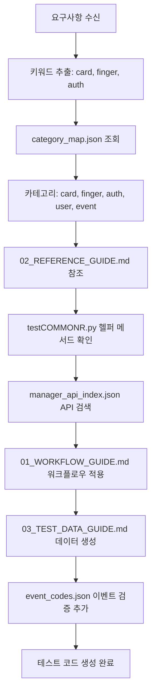

# G-SDK Python RAG Context System

## 개요 (Overview)

이 RAG 컨텍스트 시스템은 LLM이 G-SDK Python 자동화 테스트 코드를 자율적으로 생성할 수 있도록 설계된 문서 구조입니다. Claude Skills/MCP context7과 유사하게, LLM이 테스트 요구사항을 분석하고 필요한 리소스를 자동으로 탐색하여 테스트 코드를 생성합니다.

This RAG context system is designed to enable LLMs to autonomously generate G-SDK Python automation test code. Similar to Claude Skills/MCP context7, the LLM analyzes test requirements and automatically explores necessary resources to generate test code.

## 구조 (Structure)

```
gsdk_rag_context/
├── README.md                    # 이 파일 (This file)
├── 01_WORKFLOW_GUIDE.md         # 7단계 테스트 워크플로우 가이드
├── 02_REFERENCE_GUIDE.md        # 파일 및 API 참조 가이드
├── 03_TEST_DATA_GUIDE.md        # 테스트 데이터 생성 및 검증 가이드
└── resources/
    ├── category_map.json        # 46개 proto 카테고리 매핑
    ├── manager_api_index.json   # ServiceManager API 색인
    └── event_codes.json         # 이벤트 코드 참조
```

## 핵심 원칙 (Core Principles)

### 1. 자율적 탐색 (Autonomous Exploration)
LLM은 케이스별 매뉴얼이 아닌 일반적인 가이드를 참조하여 스스로 필요한 리소스를 찾습니다.

The LLM refers to general guides rather than case-specific manuals to find necessary resources autonomously.

### 2. 카테고리 기반 리소스 매핑 (Category-based Resource Mapping)
테스트 요구사항 → 카테고리 추출 → 리소스 탐색 → 코드 생성

Test Requirements → Extract Categories → Explore Resources → Generate Code

### 3. 우선순위 기반 참조 (Priority-based Reference)
```
testCOMMONR.py → manager.py → util.py → example/ → pb2 → docs → proto
```

## LLM 사용 방법 (How LLMs Should Use This)

### Phase 1: 요구사항 분석 (Requirements Analysis)

1. 테스트 요구사항을 읽고 핵심 키워드 추출
2. `resources/category_map.json`에서 관련 카테고리 식별
3. 필요한 리소스 목록 생성

**Example:**
```
요구사항: "지문 전용 인증 모드에서 사용자 인증 테스트"
키워드: fingerprint, authentication, user
카테고리: finger, auth, user, event
```

### Phase 2: 리소스 탐색 (Resource Exploration)

1. `02_REFERENCE_GUIDE.md`에서 우선순위에 따라 파일 탐색
2. `resources/manager_api_index.json`에서 필요한 API 메서드 확인
3. 예제 코드 패턴 참조 (`testCOMMONR.py`, `example/`)

### Phase 3: 코드 생성 (Code Generation)

1. `01_WORKFLOW_GUIDE.md`의 7단계 워크플로우 적용
2. `03_TEST_DATA_GUIDE.md`로 테스트 데이터 생성
3. `resources/event_codes.json`으로 이벤트 검증 추가

## LLM 프롬프트 예시 (LLM Prompt Examples)

### 예시 1: 기본 인증 테스트 생성

```
Given the test requirement:
"Test fingerprint-only authentication with 3 users on BioStation 2"

Using the G-SDK RAG context system:
1. Read 01_WORKFLOW_GUIDE.md to understand the 7-phase test workflow
2. Check resources/category_map.json to identify needed categories: user, finger, auth, event
3. Read 02_REFERENCE_GUIDE.md to find:
   - testCOMMONR.py helper methods for auth mode setup
   - manager.py API methods for user enrollment and fingerprint scanning
   - util.py for EventMonitor and data generation
4. Read 03_TEST_DATA_GUIDE.md for user data generation patterns
5. Check resources/event_codes.json for authentication event codes
6. Generate complete test code following the workflow

Please generate the test code with:
- Class inheriting from TestCOMMONR
- setUp/tearDown with proper backup/restore
- 3 test users with fingerprint data
- Fingerprint-only auth mode configuration
- EventMonitor for authentication verification
- Proper assertions and cleanup
```

### 예시 2: 복잡한 액세스 제어 테스트

```
Given the test requirement:
"Test access control with 2 doors, 3 access levels, 5 users, and verify door events"

Autonomous exploration workflow:
1. Extract categories from requirement → door, access, user, schedule, event
2. From category_map.json, identify needed resources:
   - door: demo/example/door/door.py, manager methods getDoors/setDoor
   - access: demo/example/access/access.py, manager methods getAccessLevels/setAccessLevel
   - user: demo/example/user/user.py, manager methods enrollUsers
   - event: demo/example/event/event.py, EventMonitor from util.py
3. From 02_REFERENCE_GUIDE.md, check:
   - testCOMMONR.py for setUp/tearDown patterns
   - manager.py API signatures
4. From 03_TEST_DATA_GUIDE.md, plan data generation:
   - 5 users with random IDs and PINs
   - 2 door configurations
   - 3 access level configurations with door-time mapping
5. From resources/event_codes.json:
   - BS2_EVENT_USER_ACCESS_GRANTED (0x2000)
   - BS2_EVENT_DOOR_UNLOCKED (0x3002)
6. Follow 01_WORKFLOW_GUIDE.md 7-phase workflow to generate code

Generate comprehensive test code with proper structure.
```

### 예시 3: 마스터-슬레이브 테스트

```
Requirement: "Test fingerprint authentication on slave device connected via RS485"

LLM autonomous analysis process:
1. Keywords: fingerprint, slave, rs485, authentication
2. Categories (from category_map.json): finger, rs485, auth, user, event, connect
3. Resource exploration priority:
   a. testCOMMONR.py:
      - self.slaveIDs for slave device access
      - getFingerprintInputSupportedDevice() helper
      - setFingerprintOnlyAuthMode() helper
   b. manager.py (via manager_api_index.json):
      - getSlaveList(masterID)
      - isSlave(deviceID)
      - setAuthConfig(deviceID, config)
      - enrollUsers(deviceID, users)
   c. util.py:
      - EventMonitor for slave device events
   d. 02_REFERENCE_GUIDE.md Section 4.5: Master-Slave pattern
4. Data generation (03_TEST_DATA_GUIDE.md):
   - User with fingerprint template
   - AuthConfig with fingerprint-only mode
5. Event validation (event_codes.json):
   - BS2_EVENT_IDENTIFY_SUCCESS with BS2_SUB_EVENT_VERIFY_FINGER

Generate test code following master-slave testing pattern.
```

## 파일별 역할 (File Roles)

### 01_WORKFLOW_GUIDE.md
- **목적**: 테스트 생성의 전체 흐름 이해
- **사용 시점**: 테스트 코드 구조 설계 시
- **핵심 내용**: 7단계 워크플로우, 표준 패턴, 체크리스트

### 02_REFERENCE_GUIDE.md
- **목적**: 파일 및 API 참조 방법
- **사용 시점**: 구현 중 API 검색 필요 시
- **핵심 내용**: 카테고리별 리소스, 우선순위 시스템

### 03_TEST_DATA_GUIDE.md
- **목적**: 테스트 데이터 생성 및 검증
- **사용 시점**: 사용자/설정 데이터 생성 필요 시
- **핵심 내용**: 데이터 생성 패턴, 검증 전략

### resources/category_map.json
- **목적**: 카테고리-리소스 자동 매핑
- **사용 시점**: 요구사항에서 카테고리 추출 시
- **핵심 내용**: 46개 카테고리, 키워드, 파일 경로, manager 메서드

### resources/manager_api_index.json
- **목적**: ServiceManager API 빠른 검색
- **사용 시점**: 특정 기능 구현 시 API 메서드 찾을 때
- **핵심 내용**: 기능별 그룹화된 메서드, 시그니처, 리턴 타입

### resources/event_codes.json
- **목적**: 이벤트 검증 코드 작성
- **사용 시점**: EventMonitor 설정 시
- **핵심 내용**: 주요 이벤트 코드, 서브코드, 사용 패턴

## 작업 흐름 예시 (Workflow Example)

### Scenario: "카드+지문 인증 테스트 생성"



### 단계별 상세 (Step-by-step Details)

#### Step 1-3: 카테고리 식별
```json
// resources/category_map.json에서 발견
{
  "categories": [
    {"name": "card", "keywords": ["card", "carddata"], ...},
    {"name": "finger", "keywords": ["finger", "fingerprint"], ...},
    {"name": "auth", "keywords": ["auth", "authentication"], ...}
  ]
}
```

#### Step 4-5: 리소스 탐색
```
02_REFERENCE_GUIDE.md → Section 4.2 User Service
  - testCOMMONR.py:
    - setCardOnlyAuthMode() 참조
    - 수정하여 카드+지문 모드 설정
  - manager.py:
    - enrollUsers(deviceID, users)
    - scanCard(deviceID)
    - scanFingerprint(deviceID, format, threshold)
```

#### Step 6: API 시그니처 확인
```json
// resources/manager_api_index.json
{
  "biometrics_card": {
    "methods": [
      {
        "name": "scanCard",
        "signature": "scanCard(deviceID)",
        "returns": "CardData"
      },
      {
        "name": "scanFingerprint",
        "signature": "scanFingerprint(deviceID, format, threshold)",
        "returns": "FingerData"
      }
    ]
  }
}
```

#### Step 7-8: 워크플로우 및 데이터 생성
```python
# 01_WORKFLOW_GUIDE.md Phase 2-4 적용
# 03_TEST_DATA_GUIDE.md Section 2 참조

from demo.test.util import generateCardID, generateRandomPIN

users = []
for i in range(3):
    user = user_pb2.UserInfo()
    user.hdr.ID = randomNumericUserID()
    user.cards.append(user_pb2.CardData(data=generateCardID()))
    user.fingers.append(fingerData)  # from scanFingerprint
    users.append(user)
```

#### Step 9: 이벤트 검증 추가
```python
# resources/event_codes.json 참조
# BS2_EVENT_VERIFY_SUCCESS | BS2_SUB_EVENT_VERIFY_CARD_FINGER = 0x1008

with EventMonitor(self.svcManager, self.targetID,
                  eventCode=0x1008,
                  userID=user.hdr.ID) as monitor:
    self.svcManager.detectCard(deviceID, user.cards[0].data)
    self.svcManager.detectFingerprint(deviceID, user.fingers[0].data)
    self.assertTrue(monitor.caught(timeout=3.0))
```

## 베스트 프랙티스 (Best Practices)

### For LLMs:

1. **항상 category_map.json부터 시작** (Always start with category_map.json)
   - 요구사항의 키워드로 카테고리 식별
   - 필요한 모든 카테고리 나열

2. **우선순위 순서 준수** (Follow priority order)
   - testCOMMONR.py에 헬퍼 메서드가 있는지 먼저 확인
   - manager.py API 메서드 사용
   - 필요시 example/ 및 pb2 참조

3. **EventMonitor 항상 사용** (Always use EventMonitor)
   - 실제 동작 검증 필수
   - event_codes.json으로 올바른 이벤트 코드 사용

4. **데이터 생성은 util.py 우선** (Prioritize util.py for data generation)
   - randomNumericUserID(), generateCardID() 등 활용
   - 03_TEST_DATA_GUIDE.md 패턴 참조

5. **setUp/tearDown 자동화** (Automate setUp/tearDown)
   - TestCOMMONR 상속으로 자동 백업/복원
   - 추가 리소스는 명시적 정리

## 트러블슈팅 (Troubleshooting)

### Q: 필요한 카테고리를 찾을 수 없음
A: `resources/category_map.json`의 keywords 배열 확인. 동의어나 관련 용어로 검색.

### Q: API 메서드 사용법을 모르겠음
A: 우선순위 순서 확인:
1. `02_REFERENCE_GUIDE.md` 카테고리별 섹션
2. `resources/manager_api_index.json` 시그니처
3. `example/{category}/{category}.py` 예제 코드
4. `demo/biostar/service/{category}_pb2.py` 메시지 정의

### Q: 이벤트 코드를 어떻게 조합하나요?
A: `resources/event_codes.json`의 "event_code_calculation" 참조:
```python
full_code = base_code | sub_code
# Example: VERIFY_SUCCESS + ID_PIN = 0x1000 | 0x01 = 0x1001
```

### Q: Master-Slave 테스트 구조가 헷갈림
A: `02_REFERENCE_GUIDE.md` Section 4.5 참조:
- `testCOMMONR.py`의 `self.slaveIDs` 사용
- `getFingerprintInputSupportedDevice(self.slaveIDs)` 등 헬퍼 메서드 활용

## 업데이트 및 확장 (Updates and Extensions)

이 RAG 시스템은 다음과 같이 확장 가능합니다:

This RAG system can be extended as follows:

1. **새 카테고리 추가**: `category_map.json`에 카테고리 정의 추가
2. **새 API 추가**: `manager_api_index.json`에 메서드 추가
3. **새 이벤트 코드**: `event_codes.json`에 이벤트 추가
4. **새 패턴**: 해당 가이드 문서에 섹션 추가

## 참고 자료 (References)

- G-SDK Python Official Docs: https://supremainc.github.io/g-sdk/python/
- G-SDK GitHub: https://github.com/supremainc/g-sdk-python
- Demo Code: `demo/example/`
- Test Code: `demo/test/`, `demo/test2/`

## 라이선스 및 저작권 (License and Copyright)

Copyright (c) 2023-2025 Suprema Co., Ltd. All Rights Reserved.

This RAG context system is for internal use in G-SDK Python test automation.
